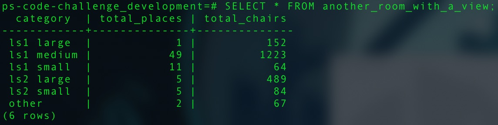

.svg)

### Welcome to the take home portion of your interview! We're excited to jam through some technical stuff with you, but first it'll help to get a sense of how you work through data and coding problems. Work through what you can independently, but do feel free to reach out if you have blocking questions or problems.

1) This requires Postgres (9.4+) & Rails(4.2+), so if you don't already have both installed, please install them.

2) Download the data file from: https://github.com/gospotcheck/ps-code-challenge/blob/master/Street%20Cafes%202020-21.csv

3) Add a varchar column to the table called `category`.

4) Create a view with the following columns [provide the view SQL]  
    - post_code: The Post Code  
    - total_places: The number of places in that Post Code  
    - total_chairs: The total number of chairs in that Post Code  
    - chairs_pct: Out of all the chairs at all the Post Codes, what percentage does this Post Code represent (should sum to 100% in the whole view)  
    - place_with_max_chairs: The name of the place with the most chairs in that Post Code  
    - max_chairs: The number of chairs at the place_with_max_chairs  

  I changed the name of `street_cafes` table to `restaurants`.
  I'm happy to discuss this decision in the technical review.
  Or maybe you don't care, and now I'm explaining something and just wasting
  your time, if that's the case, then I wish I didn't make this sentence so long.

```sql
 CREATE VIEW the_room_with_a_view AS
 SELECT post_code,
        COUNT(street_address) AS total_places,
        SUM(number_of_chairs) AS total_chairs,
        ROUND((SUM(number_of_chairs) * 100.00) / ((SELECT SUM(number_of_chairs) FROM restaurants) * 100.00) * 100, 2) AS chairs_pct,
        cafes_with_max_chairs_in_post_code.name AS place_with_max_chairs,
        MAX(number_of_chairs) AS max_chairs
 FROM   restaurants
 JOIN  (SELECT restaurants.name, restaurants.post_code AS max_post_code
        FROM restaurants
        JOIN (SELECT post_code, MAX(number_of_chairs) as max_number_of_chairs
              FROM restaurants
              GROUP BY post_code) max_chairs_in_post_code
        ON   restaurants.post_code = max_chairs_in_post_code.post_code
        AND  restaurants.number_of_chairs = max_chairs_in_post_code.max_number_of_chairs) cafes_with_max_chairs_in_post_code
 ON     cafes_with_max_chairs_in_post_code.max_post_code = post_code
 GROUP BY post_code, cafes_with_max_chairs_in_post_code.name;
```

Validations for this SQL query are in `spec/sql/sql_query_spec.rb` under
`describe "Testing View Query for Section 4" do` (Line:4)

5) Write a Rails script to categorize the cafes and write the result to the category according to the rules: [provide the script]  
    - If the Post Code is of the LS1 prefix type:  
        - `# of chairs less than 10: category = 'ls1 small'`  
        - `# of chairs greater than or equal to 10, less than 100: category = 'ls1 medium'`  
        - `# of chairs greater than or equal to 100: category = 'ls1 large' `  
    - If the Post Code is of the LS2 prefix type:  
        - `# of chairs below the 50th percentile for ls2: category = 'ls2 small'`  
        - `# of chairs above the 50th percentile for ls2: category = 'ls2 large'`  
    - For Post Code is something else:  
      - `category = 'other'`  

    All testing for 5 is in `spec/tasks/mutate_restaurant_data_spec.rb`

6) Write a custom view to aggregate the categories [provide view SQL AND the results of this view]
    - category: The category column
    - total_places: The number of places in that category
    - total_chairs: The total chairs in that category
```sql
CREATE VIEW another_room_with_a_view AS
SELECT category,
       COUNT(name) AS total_places,
       SUM(number_of_chairs) AS total_chairs
FROM restaurants
GROUP BY category
ORDER BY category;
```


Validations for this SQL query are in `spec/sql/sql_query_spec.rb` under
`describe "Testing View Query for Section 6" do` (Line:64)

7) Write a script in rails to:
    - For street_cafes categorized as small, write a script that exports their data to a csv and deletes the records
    - For street cafes categorized as medium or large, write a script that concatenates the category name to the beginning of the name and writes it back to the name column

    All testing for 7 is in `spec/tasks/mutate_restaurant_data_rename_with_category_spec.rb`

8) Show your work and check your email for submission instructions.

9) Celebrate, you did great!
